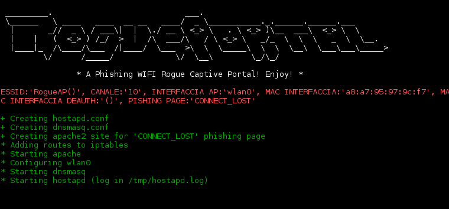

# ATTENZIONE:
Ho riscontrato vari problemi nello script che, prontamente, sto sistemando. Quindi lo script potrebbe dar problemi. Purtroppo ho avuto da fare in questa settimana, ma comunque sono a buon punto.
Quindi quando non vedrete piu' questo messaggio significhera' che tutti i bug (almeno quelli piu' gravi)
sono stati corretti.
Scusatemi ;)

# RoguePortal :smiling_imp:

```
 _________.                            ___.                                       
 \______   \ ____   ____  __ __   ____/  _ \___________._.______.______.___       
  |       _//  _ \ / ___\|  |  \./ __ \ <_> \   . \ <_> )\__  ___\  <_> \  \      
  |    |   (  <_> ) /_/  >  |  /\  ___/\   / \ <_> \   _/_  \  \  \   _  \  \__.  
  |____|_  /\____/\___  /|____/  \___  >\  \  \_____\  \  \  \__\  \___\___\_____> 
         \/      /_____/             \/  \__\        \_/\_/
```    
**A Phishing Rogue Captive Portal! New concept for hacking:** *"Simply and fast for the lazy"*

# Descrizione

RoguePortal sfrutta i captive portal per estorcere informazioni sensibili.
Perchè usare proprio il Captive Portal? Il captive portal è molto utile sui dispositivi mobili
come ad esempio i cellulari. Oggi tutti hanno un telefono e principalmente lo utilizziamo per messaggiare con le varie
app di messaggistica instantanea: facebook, whatsapp, telegram, twitter, ecc... i "tempi del browser" su i cellulari stanno per finire ;).
Per questo motivo, l'approccio adottato da altri tool di phishing, come ad esempio "wifiphisher", presuppone che l'utente debba andare almeno su un motore di ricerca per essere reindirizzato sulla pagina malevola. RoguePortal, invece, sfrutta il CaptivePortal in modo da, non appena il client si collegherà al nostro AP malevolo, fargli aprire in automatico sul suo dispositivo la nostra pagina di login malevola, senza che la persona debba necessariamente andare su un browser!. Questo suo punto di forza aumenta ancor di più la probabilità di successo del nostro attacco. L'unica pecca di questo attacco(per il momento) è che necessita di una connessione ad internet, dato che servirà al dispositivo per capire che la rete richiede una forma di autenticazione. Vi invito a fare una ricerca su internet per comprendere al meglio cos'è questo Captive Portal e soprattutto come funziona.

# Dipendenze

- apache2
- hostapd
- dnsmasq
- php
- macchanger
- aircrack-ng
- iwlist
- wireless-tools
- rfkill
- nohup
- psmisc (for tool killall)
- sudo

# Configurazione

Prima di continuare, assicuratevi di abilitare apache2 all'utilizzo di alcuni comandi.
Inserite nel file */etc/sudoers* la seguente riga:
```
www-data ALL=(ALL:ALL) NOPASSWD: /sbin/iptables, /usr/sbin/arp, /usr/bin/killall
```
A volte i percorsi dei vari binari possono variare da distro a distro. In ogni modo, è sempre una buona idea controllare, per evitare problemi in futuro.
Per controllare i percorsi dei vari binari (*iptables, killall, arp*), utilizzare l'utility **whereis**:

```
whereis -b iptables
whereis -b arp
whereis -b killall
```

Se l'utility riporta dei percorsi diversi, cambiateli con quelli ottenuti dal comando.

# Esecuzione



**RoguePortal** accetta 3 interfacce di rete; in realtà necessita di almeno 2 interfacce.. la terza è opzionale.
In sostanza:

- 1° interfaccia: Va collegata ad internet
- 2° interfaccia: Verrà utilizzata per creare gli AP malevoli
- **3° interfaccia**: Verrà usata per il deauth, cioà la deautenticazione dei client collegati ad un AP

Digitate *./rogueportal.sh -h* per avere una lista più completa delle opzioni disponibili:

```
$ sudo ./rogueportal -h

 _________.                            ___.                                       
 \______   \ ____   ____  __ __   ____/  _ \___________._.______.______.___       
  |       _//  _ \ / ___\|  |  \./ __ \ <_> \   . \ <_> )\__  ___\  <_> \  \      
  |    |   (  <_> ) /_/  >  |  /\  ___/\   / \ <_> \   _/_  \  \  \   _  \  \__.  
  |____|_  /\____/\___  /|____/  \___  >\  \  \_____\  \  \  \__\  \___\___\_____> 
         \/      /_____/             \/  \__\        \_/\_/
                 
                  * A Phishing WIFI Rogue Captive Portal! Enjoy! *
                                 
 Usage: ./rogueportal.sh -w [Interfaccia hotspot] -e [AP network name/target] -f [Pagina phishing] -i [Interfaccia collegata a internet]

 -w             Interfaccia da utilizzare come Access Point
 -e             ESSID della rete
 -f             Numero pagina di phishing. Accetta solo valore numerico
                   Digita './rogueportal.sh -l'
 -i                Interfaccia collegata ad internet

 [ OPTIONAL ]

 -l             Lista delle pagine di phishing disponibili
 -c             Canale della rete
 -m             Mac address da utilizzare
 -C             Imposta la clonazione dell'AP se trova l'essid nelle vicinanze, impostato con
                l'opzione '-e',
 -p             Mantiene la connessione dopo aver catturato le password. Di default lo script
                si chiude automaticamente
 -a             Attacca la rete scollegando i client dell'AP legittimo per
                farli collegare all'AP Rogue. Come argomento, necessita di una
                  seconda scheda di rete per il deauth
```

Alcuni esempi:

```
./rogueportal.sh -w wlan0 -e RogueAP -f0 -i wlan1    Crea un ap chiamato RogueAP utilizzando l'interfaccia wlan0 come AP, la pagina di phishing '0' e l'interfaccia wlan1 per la connessione ad internet.
./rogueportal.sh -w wlan0 -C -e RogueAP -f0 -i wlan1    Clona l'ap nelle vicinanze chiamato RogueAP. wlan0 sarà usata come interffaccia AP.
./rogueportal.sh -w wlan0 -C -e RogueAP -i wlan1 -a wlan2 -f0     Clona l'ap RogueAP e lancia l'attacco di 'deauth' contro quest'ultima. I client si connetteranno all'AP rogue creato da noi.
./rogueportal.sh -w wlan0 -e RogueAP -m 11:22:33:44:55:66 -f0 -i wlan1    Crea un ap chiamato RogueAP avente come mac address '11:22:33:44:55:66'.
```

# In futuro

RoguePortal è in costante aggiornamento. Cercherò di migliorare e implementare nuove funzioni appena possibile.
Lavorerò ad un modo per poter utilizzare un Captive Portal anche in modalità offline, quindi senza la necessità di utilizzare una connesione internet.

# Donazioni

**BTC:** *3EwV4zt9r5o4aTHyqjcM6CfqSVirSEmN6y*

# Contatti

**Email:** *developer.vincenzog@gmail.com*
